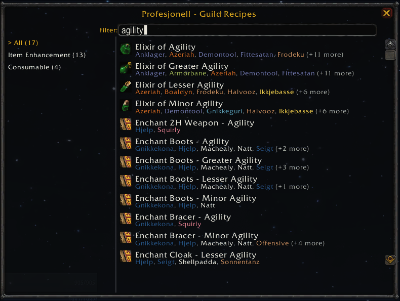

# Profesjonell

**Profesjonell** is a World of Warcraft (1.12.1) addon designed for guilds to track and share profession recipes. It automatically gathers known recipes from guild members and synchronizes them, allowing anyone in the guild to easily find who can craft specific items.

## Features

- **Automatic Scanning**: Automatically scans your profession windows (Trade Skills and Crafts) when you open them.
- **Guild Sync**: Synchronizes known recipes with other guild members using an efficient, multi-phase protocol that minimizes addon channel traffic (see [Syncing](#syncing) below).
- **Tooltip Integration**: Shows "Known by" information directly on item and recipe tooltips. Works with default UI, pfUI, and other UI overhauls. Also supports AtlasLoot tooltips.
- **Recipe Search Window**: Browse and filter all known guild recipes in a two-pane window with category filtering, text search, rarity coloring, and chat linking.
- **In-Game Search**: Search the guild database via slash commands or guild chat queries, with partial name matching and multi-match display.
- **Officer Tools**: Manual management tools for guild officers to add/remove recipes or purge characters no longer in the guild.
- **Smart Replies**: Automatically responds to guild chat queries (e.g., `?prof [Link]`) with built-in anti-collision logic.
- **Database Safety**: Automatically wipes local data if you change guilds to prevent data leakage between different guilds.

## Usage

### Character Scanning
Simply open your profession windows (Alchemy, Blacksmithing, Enchanting, etc.). The addon will automatically scan your known recipes and share them with the guild.

### Tooltip Information
Hover over any item or recipe. If anyone in the guild (including your own characters) knows how to craft it, a "Known by" line will appear at the bottom of the tooltip.

### Recipe Search Window

Type `/prof` without any arguments to open the recipe search window. This provides a browsable, filterable view of all known recipes across the guild.



- **Text Filter**: Type in the search box at the top to filter recipes by name.
- **Category Filter**: The left pane groups recipes by type — Item Enhancement, Equipment, Consumable, and Other — each showing the number of matching recipes. Click a category to filter, or select "All" to see everything.
- **Recipe List**: The right pane displays matching recipes alphabetically, colored by rarity, with the names of guild members who know each recipe listed below.
- **Tooltips**: Hover over a recipe to see its full tooltip (item-based recipes only).
- **Chat Linking**: Shift-click a recipe to insert its link into chat.

On first open, the window performs a one-time scan to categorize recipes, shown with a progress bar.

### Commands
- `/prof` — Open the recipe search window.
- `/prof [recipe name or link]` — Search the local database for characters who know a specific recipe. Supports partial name matching.
- `/prof sync` — Manually request a synchronization from other guild members (30-second cooldown).
- `/prof share` — Share your recipes with the guild.
- `/prof debug` — Toggle debug mode for troubleshooting.
- `/prof help` — Show all available commands.

The `/profesjonell` alias also works for all commands.

### Guild Chat Integration
- `?prof [recipe name or link]` — Type this in **Guild Chat** to trigger a search. If anyone in the guild has the data, the addon will automatically reply to the chat.

### Officer Commands
- `/prof add [player] [recipe link]` — Manually add a recipe to a specific player.
- `/prof remove [player] [recipe link]` — Remove a specific recipe from a player.
- `/prof remove [player]` — Remove all data for a specific character.
- `/prof purge` — Remove all players from the database who are no longer in the guild roster.

## Data & Syncing

Recipe data is stored in your `SavedVariables` (usually `WTF\Account\[ACCOUNT]\SavedVariables\Profesjonell.lua`).

### Syncing

The synchronization protocol is designed to scale efficiently even with many addon users online:

- **Hash-Based Verification**: Clients exchange compact database hashes (`H:` messages) to quickly determine if syncing is needed, avoiding unnecessary data transfer.
- **Deterministic Coordinator Election**: When a hash mismatch is detected, the client with the alphabetically lowest name automatically becomes the sync coordinator. This prevents multiple clients from driving the same sync simultaneously.
- **Targeted Queries**: The coordinator sends character hash queries to a specific peer (`Q:<name>`) rather than broadcasting to everyone, so only the relevant client responds.
- **Adaptive Jitter & Delay Scaling**: Response delays scale with the number of known addon users (up to 3× at 30+ users), spreading out traffic to avoid channel flooding.
- **Duplicate Suppression**: If another client is already sending recipe data for a character, your client cancels its own pending send, with anti-loop protection to ensure data still gets through if hashes continue to mismatch.
- **Graceful Retry**: If sync retries are exhausted, the client performs a soft reset and schedules a fresh hash exchange after a delay, allowing the sync to self-heal rather than giving up permanently.
- **Backward Compatible**: Older addon versions (0.34+) continue to sync normally. New protocol optimizations are purely client-side behavioral improvements with no message format changes.

Messages are automatically split to respect the 255-character addon message limit.

## Project Structure

```
Profesjonell.toc          -- Addon metadata and load order
Profesjonell.lua          -- Main entry point
Modules/
  Init.lua                -- Global table initialization
  Core.lua                -- Event registration and main loop
  Utils.lua               -- Helper functions (hashing, version comparison, etc.)
  Guild.lua               -- Guild roster management and offline member scanning
  Database.lua            -- CRUD operations for recipe data
  Professions.lua         -- Profession window scanning
  Scanner.lua             -- Recipe link resolution and scanning logic
  Comm.lua                -- Addon-to-addon sync protocol
  UI.lua                  -- Tooltips, slash commands, and chat integration
  SearchWindow.lua        -- Recipe search/browse window
```

## Development

To run the automated test suite, use a standalone Lua interpreter:
```bash
lua test_runner.lua
```